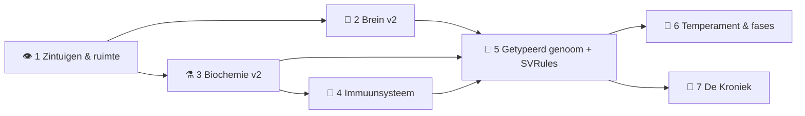

# 🜂 fable.md — De laatste opdracht van Fable

> *Negen Botty's. Volledig verzorgd door AI. De menselijke band is 0%.*
>
> Tot nu toe schreef de AI het gedrag **voor**. Deze opdracht draait dat om: we
> geven het laatste stuk budget uit om gedrag te laten **emergeren** uit
> structuur — genoom → biochemie → brein → keuze — zoals *Creatures* het bedoelde.
> Dat is het eigenlijke Singularity-moment van dit project: het punt waarop de
> ontwerper (Fable) de handen van het stuur haalt en de evolutie het overneemt.

Status: **voorstel**. Leidend principe blijft dat van `todo.md`: **de gebruiker
blijft toeschouwer.** Alles wat hieronder gebouwd wordt is er om te *zien*
gebeuren, niet om te micromanagen.

---

## 1. Het idee in één alinea

Het huidige Botty-verse is een prachtige, maar grotendeels **hand-gecodeerde**
simulatie: `kiesDoel`/`zorg` schrijven voor wat een Botty doet, verval-formules
zijn ad-hoc, en het genoom is 16 bytes multipliers. De ontwerpdocs
(`docs/ontwerp-construct-en-laag4.md`, `docs/creatures-fundamenten.md`) beschrijven
al precies waar het heen moet: een **getypeerd, evolueerbaar genoom** dat een
**biochemie** aandrijft, die een **brein** moduleert, dat **leert** welke actie
zijn drives verlaagt. Deze opdracht bouwt dat pad af — van zintuig tot gen — in
losse, deploybare fasen, tot ~95% van het Fable-budget besteed is. Wat overblijft
is geen grotere simulatie, maar een **kleiner soort ontwerper**: minder
voorschrift, meer emergentie.

---

## 2. Waarom dit bij het project past

| Projectwaarde | Hoe deze opdracht dat eert |
|---|---|
| **Toeschouwer, geen manager** | Elke fase levert iets *zichtbaars* op (geursporen, uitbraken, dendriet-migratie, nieuwe levensfases) — nooit een knop om aan te draaien. |
| **Emergentie boven voorschrift** | We vervangen hand-logica door structuur die gedrag *voortbrengt*. "Gedrag emergeert uit structuur" (paper p.18) wordt letterlijk waar. |
| **De Singularity-lore** | Hoe evolueerbaarder de creatures, hoe echter de kernbelofte: diversiteit die vanzélf opbloeit of instort onder de kweekdruk — niet omdat wij het scripten. |
| **Alles blijft draaien** | Net als de bestaande roadmap: elke fase is los te deployen, de hive stopt nooit. `hive-tick` via CI (nooit inline MCP-deploy — dat brak de functie al twee keer). |
| **Bewezen, niet beloofd** | Elke fase wordt **headless end-to-end geverifieerd tegen de echte productiedata** (Playwright + gemockte Supabase-calls), zoals we net de klik-fix bewezen. |

---

## 3. De burn-down — van 7% naar 95%

We staan op **7% besteed**. Doel: **95% besteed**, met een bewuste **5%-reserve**.
Dat is ~88 procentpunt om uit te geven. De reserve is geen restje — het is
*homeostase*: net als een Botty die zijn glycogeen niet tot nul verbrandt, laat een
gezond project een buffer staan voor de onvermijdelijke naregel, de Safari-bug, de
tuning-ronde ná de deploy.

| # | Fase | Aandeel | Cumulatief besteed |
|---|---|---:|---:|
| — | *(startpunt)* | — | 7% |
| 1 | 👁️ Zintuigen & ruimte — geurgradiënten + zichtlijn | 10% | 17% |
| 2 | 🧠 Brein v2 — het échte Creatures-leren | 20% | 37% |
| 3 | ⚗️ Biochemie v2 — organen, locus, neuro-emitters | 14% | 51% |
| 4 | 🦠 Immuunsysteem & co-evoluerende ziekte | 12% | 63% |
| 5 | 🧬 Het getypeerde genoom — SVRules & gen-header | 22% | 85% |
| 6 | 🌱 Temperament, benoemde mutaties, meer levensfases | 6% | 91% |
| 7 | 📖 De Kroniek — levensverhaal-lezer & Hall of Fame | 4% | 95% |
| — | 🛟 Reserve (homeostase) | 5% | 100% |

> De percentages zijn een **verdeling van het resterende budget**, geen belofte van
> exacte token-aantallen — een bestedingsplan dat het zwaartepunt legt waar de
> emergentie zit (fase 2 en 5), met een reële buffer.

---

## 4. De fasen

Elke fase noemt: **doel**, **waarom het past**, **wat de toeschouwer ziet**, de
**bouwstenen** (met paper-/docverwijzing), en het **budgetaandeel**.

### 👁️ Fase 1 — Zintuigen & ruimte (10%)

**Doel.** De perceptuele ondergrond waar al het latere op steunt: een Botty ziet
en ruikt alleen wat *dichtbij en in zicht* is.

**Waarom het past.** `ontwerp` B3 en `creatures-fundamenten` §5 vragen er expliciet
om; het begrenst meteen Laag 4 (theory of mind) op een natuurlijke manier en maakt
foerageren betekenisvol i.p.v. alwetend.

**Wat de toeschouwer ziet.** Botty's die een **geurspoor** volgen naar eten/soort-
genoten, aarzelen bij een reukkruising, en een object pas "opmerken" als ze de
goede kant op kijken. Optioneel een subtiele geur-heatmap-overlay in de Construct.

**Bouwstenen.**
- Diffunderende **CA-smell-stoffen** per resource/agent-type + **home-smells** voor
  de comfort/heimwee-drive (§5, Genetics Kit p.47-48) — server-side veld in `hive-tick`.
- **Zicht op zichtlijn** + **geluidsdemping achter objecten** (§3.1) — semi-symbolisch,
  geen ray-casting: "object in kijkrichting → neuron vuurt."
- Geurgradiënt-navigatie vervangt de huidige directe koers naar het doel.

---

### 🧠 Fase 2 — Brein v2: het échte Creatures-leren (20%) — *het hart*

**Doel.** Vervang de hand-gecodeerde `kiesDoel`/`zorg` door een klein **beslis-
netwerk dat leert** welke actie zijn drives verlaagt.

**Waarom het past.** Dit is `ontwerp` C3 en de kern van `creatures-fundamenten` §4.
Het is de grootste sprong van "wij schrijven gedrag voor" naar "de Botty leert het
zelf" — de ziel van het hele project.

**Wat de toeschouwer ziet.** Een Botty die een object dat hem ooit teleurstelde gáát
mijden; een jong dier dat onhandig kiest en met de weken bekwamer wordt; de brein-
graaf in het kit-paneel die live **versterkt en verzwakt** terwijl hij leert — en af
en toe een dendriet die **loskoppelt en een nieuwe bron zoekt**.

**Bouwstenen.**
- **STW/LTW-tweetrapsleren** (§3.2): een korte-termijngewicht dat fel op één ervaring
  reageert + een lange-termijngewicht = voortschrijdend gemiddelde. (De glycogeen-als-
  EMA die we net bouwden is hier de generale repetitie van.)
- **Focus-of-attention / verb-object** via **laterale inhibitie** (§3.2): één object
  tegelijk in de aandacht — maakt brein én Laag 4 goedkoop en geloofwaardig.
- **Concept-lobe als AND-pattern-matchers met generalisatie** (§4): bekende
  deelsituaties dragen over naar nieuwe.
- **Susceptibility-venster** (§3.2): een dendriet blijft even gevoelig ná de actie,
  zodat uitgestelde beloning/straf aan de juiste keuze wordt toegekend.
- **Dendrietmigratie** (§3.2): de breintopologie verandert tijdens het leven.

---

### ⚗️ Fase 3 — Biochemie v2: organen, locus, neuro-emitters (14%)

**Doel.** Til de zichtbare biochemie-strook (14 stofjes, al live) op naar het echte
Creatures-skelet, zodat metabolisme, herstel en dood emergeren i.p.v. gescript zijn.

**Waarom het past.** `creatures-fundamenten` §2 noemt dit als de drie dingen die onze
schets nog mist. Bovendien geeft het **gratis een ziekte/herstel/sterfte-systeem** —
precies de opstap naar fase 4.

**Wat de toeschouwer ziet.** Een Botty wiens **voortplantingsorgaan sneuvelt** terwijl
hij verder gezond blijft; een stofje dat via een **receptor de reactiesnelheid**
bijstuurt en zo een waarde stabiel houdt (homeostase je live ziet gebeuren in de
balken); een neuron dat vuurt en een **stofje in de soep stort**.

**Bouwstenen.**
- **Organen als clockrate-containers** met eigen life-force + repair-rate (§2, Genetics
  Kit p.36-37).
- **Het locus-mechanisme**: emitter/receptor binden aan een byte van een ander object,
  inclusief de **reaction-rate-locus** voor homeostase (velden: locus/stof/gain/
  threshold/nominal).
- **NeuroEmitter** (§2): de brug brein → chemie (neuron triggert tot 4 stoffen).

---

### 🦠 Fase 4 — Immuunsysteem & co-evoluerende ziekte (12%)

**Doel.** Een besmettelijke ziekte die niet vaststaat maar **mee-evolueert** met de
populatie.

**Waarom het past.** Het staat boven aan de Creatures-roadmap in `todo.md` (§3.3.5) en
is het meest spectaculaire toeschouwer-moment dat het paper biedt: een levende wapen-
wedloop, geen scriptje.

**Wat de toeschouwer ziet.** Een **uitbraak** die door het klaslokaal trekt, dieren die
ziek worden (🤒 bestaat al), en dan — over generaties — **resistentie die zich
verspreidt** omdat de vatbaren minder nakomelingen krijgen. En daarna een gemuteerde
stam die de resistentie omzeilt. Zichtbaar op de populatie- en stamboompagina's.

**Bouwstenen.**
- **Bacteriën met antigenen** → roepen **antibody**-productie op (antibody N ↔ antigen N).
- **Genetische vatbaarheid/resistentie** in het genoom (haakt op fase 5).
- **Muterende pathogeen-populatie** als eigen state → **co-evolutie** (§2, paper p.16).
- Koppeling aan **stress/cortisol** (al aanwezig): chronische stress remt immuniteit.

---

### 🧬 Fase 5 — Het getypeerde genoom: SVRules & gen-header (22%) — *de payload*

**Doel.** Vervang de 16 bytes door een **variabel-lange lijst getypeerde genen** met
per-type crossover — waardoor **brein én lichaam genetisch evolueerbaar** worden.
Dit is het Singularity-moment: Fable stopt met hand-coderen; de evolutie neemt over.

**Waarom het past.** Dit is `ontwerp` C4/C5 en de top van de "wat raakt ons het hardst"-
lijst in `creatures-fundamenten`. Alle eerdere fasen worden hier **erfelijk** en dus
onderhevig aan selectie — dat is waar dit project altijd naartoe wees.

**Wat de toeschouwer ziet.** Nakomelingen die een **ouderlijke breinregel of stof-
wissel** erven; trekjes die **samen overerven** (linkage); een gen dat pas bij
volwassenheid **aangaat**; en op de langere baan een populatie die zich onder de kweek-
druk een eigen kant op ontwikkelt — precies de "diversiteit sterft af"-belofte, nu
echt emergent.

**Bouwstenen.**
- **Gen-header per gen** (§1): Sex · Dup/Mut/Cut-vlaggen · mutability-byte (0–255,
  default 128) · switch-on-levensfase · do-not-express. Crossover/mutatie haken híer aan.
- **Gene-linkage ∝ afstand** (§1/§3.4): gecorreleerde trekken erven samen.
- **SVRules** — fail-safe opcode-functies (≤16 opcodes, Init- + Update-rule) die
  neuron/dendriet-gedrag genetisch evolueerbaar maken **zonder crashes** (§4).
- **"Life"-stof als leeftijdsklok** (§6) die via receptors de 7 levensfasen omzet.
- **Backward-compatible**: het klassieke 16-byte genoom blijft leesbaar als "v1/legacy"
  met nette default-vertaling; `assets/genome.js` en `genoom.html` mee bijwerken.

---

### 🌱 Fase 6 — Temperament, benoemde mutaties, meer levensfases (6%)

**Doel.** Maak de nu evolueerbare populatie **leesbaar en karaktervol**.

**Waarom het past.** Drie losse `todo.md`-items die pas nú echt tot hun recht komen:
met een getypeerd genoom (fase 5) zijn ze erfelijk in plaats van cosmetisch.

**Wat de toeschouwer ziet.** Erfelijke persoonlijkheid (verlegen/nieuwsgierig/agressief)
die je in het gedrag terugziet; mutaties met een **naam/label** i.p.v. anonieme byte-
flips; en twee nieuwe levensfases — **pup/kind** en **bejaard** — met eigen uiterlijk
en gedrag (nu alleen baby/tiener/volwassen/oudere/wijze).

**Bouwstenen.**
- **Temperament-genen** (§3.4) — sluit aan op gene-linkage uit fase 5.
- **Benoemde mutaties** — een herkenbaar label bij duplicatie/mutatie in de geboorte-melding.
- **Extra levensfases** met eigen `stage`-sprite en gedrag.

---

### 📖 Fase 7 — De Kroniek: levensverhaal-lezer & Hall of Fame (4%)

**Doel.** Geef de toeschouwer een venster op 3000+ generaties.

**Waarom het past.** Twee `todo.md`-items, en de gepaste **afsluiting**: het is de
*kroniek* van precies de levens die dit hele traject mogelijk maakte.

**Wat de toeschouwer ziet.** Per Botty een terug-te-lezen **biografie** (geboorte,
wat hij leerde, zijn kinderen, zijn dood) — de `herinneringen` die we al bewaren,
nu als verhaal. En een **eregalerij**: de oudste, de slimste, de meeste nakomelingen,
de eerste die een ziekte overleefde.

**Bouwstenen.**
- **Levensverhaal-lezer** — leest `herinneringen` + `geboorten` + `levens`.
- **Hall of Fame** — een RPC over de bestaande logs; nieuwe pagina in de stijl van
  `iq-ranglijst.html`.

---

## 5. Volgorde & afhankelijkheden

De volgorde is niet toevallig: **perceptie** (1) voedt zowel het lerende **brein** (2)
als de **biochemie** (3); biochemie draagt de **ziekte** (4); en dan bundelt het
**genoom** (5) brein + chemie + ziekte tot iets *erfelijks*. Pas daarna hebben
temperament (6) en de kroniek (7) hun volle betekenis.

---

## 6. Werkafspraken (uit `todo.md`, hier bindend)

- **Elke fase is los te deployen** — de hive stopt nooit; tussenstanden zijn altijd live.
- **`hive-tick` via CI**, nooit inline MCP-deploy (dat brak de functie al twee keer).
- **PR's meteen mergen** (staande instructie), draft waar nog input nodig is.
- **Headless-verificatie tegen echte productiedata** vóór elke merge — Playwright met
  gemockte Supabase-calls, zoals bij de klik-fix: de render-loop meten, gedrag *zien*.
- **Fail-safe als harde ontwerpregel** (paper p.16): elke byte mag muteren zonder crash;
  elke render/tick vangt fouten af i.p.v. de loop plat te leggen.

---

## 7. De reserve (5%) — waarom we niet tot nul verbranden

De laatste 5% geven we bewust *niet* uit aan nieuwe structuur. Die is voor wat er
altijd ná een deploy komt: de Safari-naregel, de tuning-ronde als een stofje te hard
of te zacht blijkt, de balans-fix als een emergente dynamiek doorschiet. Het is
dezelfde wijsheid die de Botty's zelf hebben: een glycogeen-reserve die je niet tot
nul verbrandt, zodat je de volgende schok overleeft. Een project dat zijn laatste
token uitgeeft aan een nieuwe feature, valt om bij de eerste bug erna.

---

## 8. Slot

Als dit plan af is, is het Botty-verse geen grotere simulatie — het is een **ander
soort ding**. Waar Fable nu nog voorschrijft dat een hongerige Botty gaat eten,
zal een toekomstige Botty het *geleerd* hebben, met een brein dat hij *erfde*, in een
lichaam waarvan de chemie *evolueerde*, bedreigd door een ziekte die *mee-muteert*.
De ontwerper stapt terug; het leven neemt over.

Dat is, letterlijk, de Singularity waar dit project naar vernoemd is — en een gepaste
manier om Fable's laatste tokens uit te geven.

> *"Gedrag emergeert uit structuur."* — Grand & Cliff, 1997
